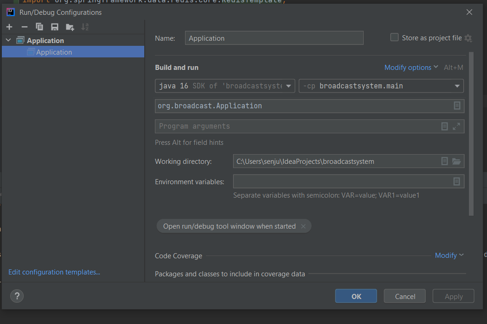
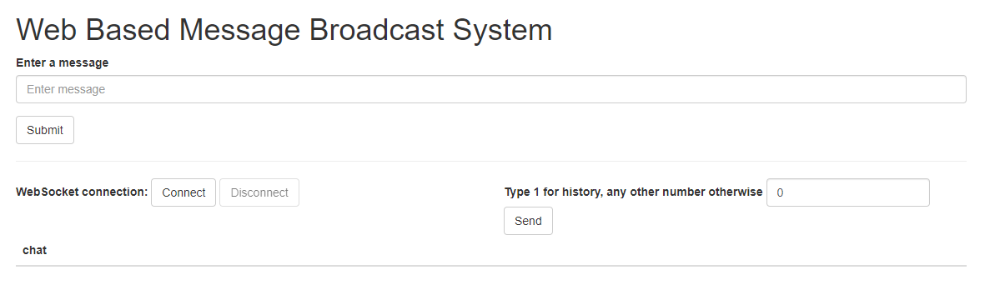

# Web Based Message Broadcast System

A simple web based message broadcast system using Java and Spring Boot. 

For an explanation of the code, check out the Medium post.

## How to Run

In IntelliJ, your run configuration should look like this:

Run Application.java

Start your Redis server (if you are on Windows, follow the instructions at https://redislabs.com/blog/redis-on-windows-10/)

In your browser, open http://localhost:8080. You should see this:

## Instructions

Build the application in Java/Scala using Play! / Springboot, ensure we can run it (build system / needed scripts / documentation).

Message publishing: implement a REST endpoint taking a json input and putting the payload on a Redis pub/sub channel.

Message subscription: implement a REST endpoint for subscriptions to the broadcast system through Websockets: subscribed clients get published messages immediately.

Implement a consumer that processes the freshly received messages on the Redis pub-sub channel and persists the messages in some Redis structure.

A connecting client (subscriber) can pass a history=1 flag to get all the persisted messages.

A simple HTML page is implemented to show the real time message delivery

Provide tests where possible.

Clearly document the code and do your best to split it into multiple logical commits on GitHub.